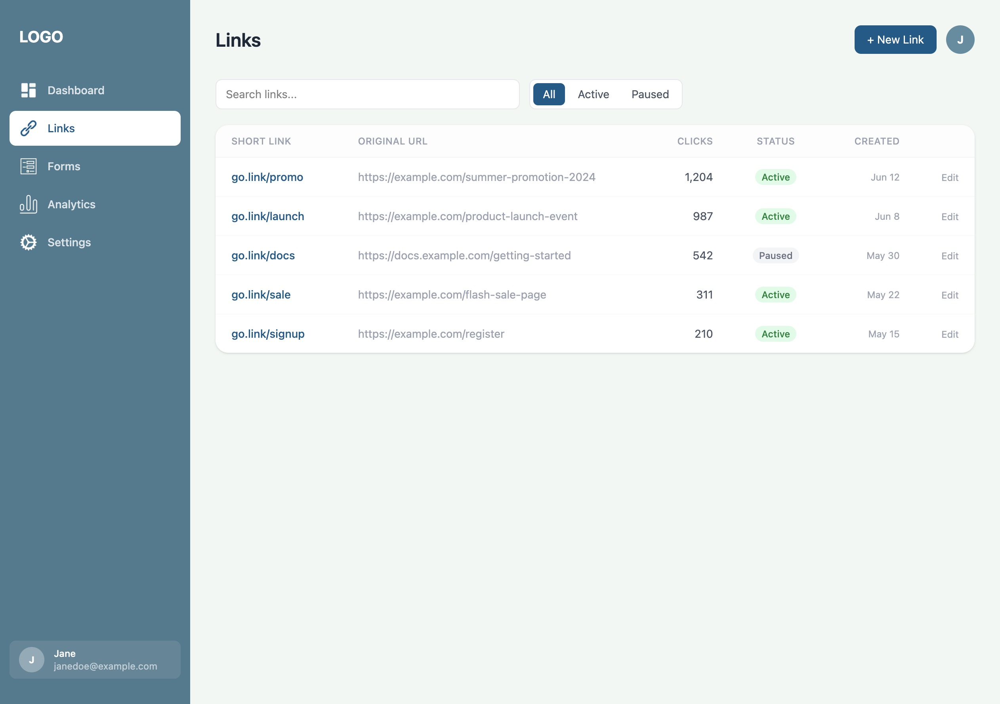
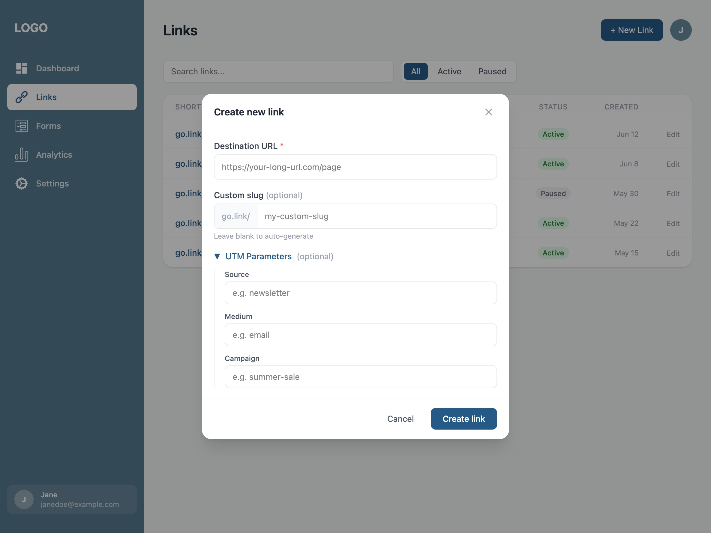
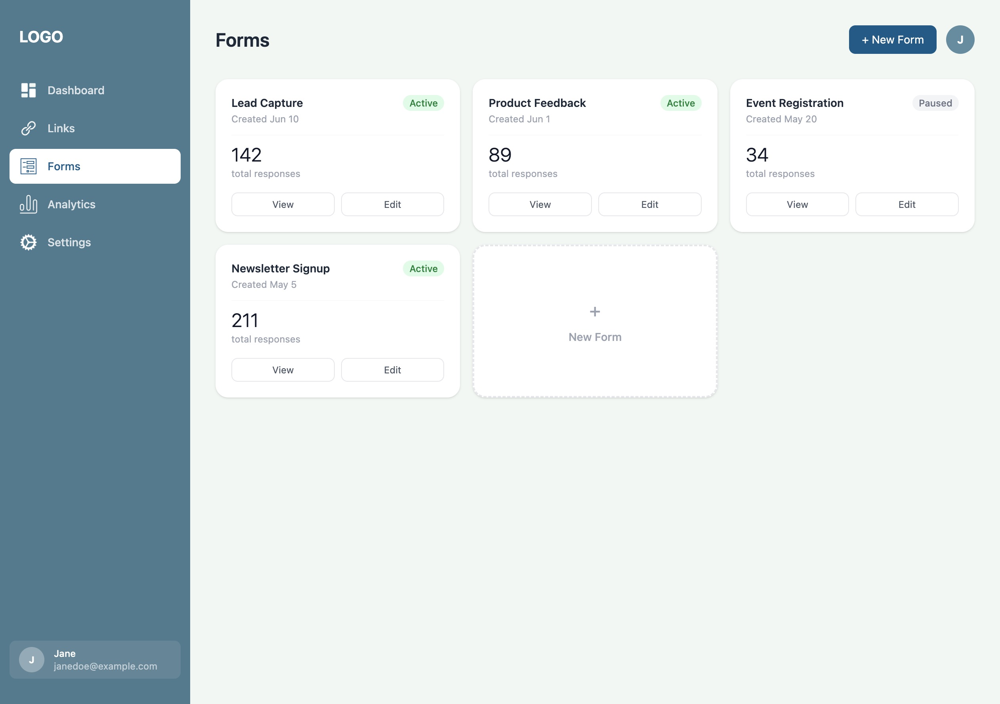
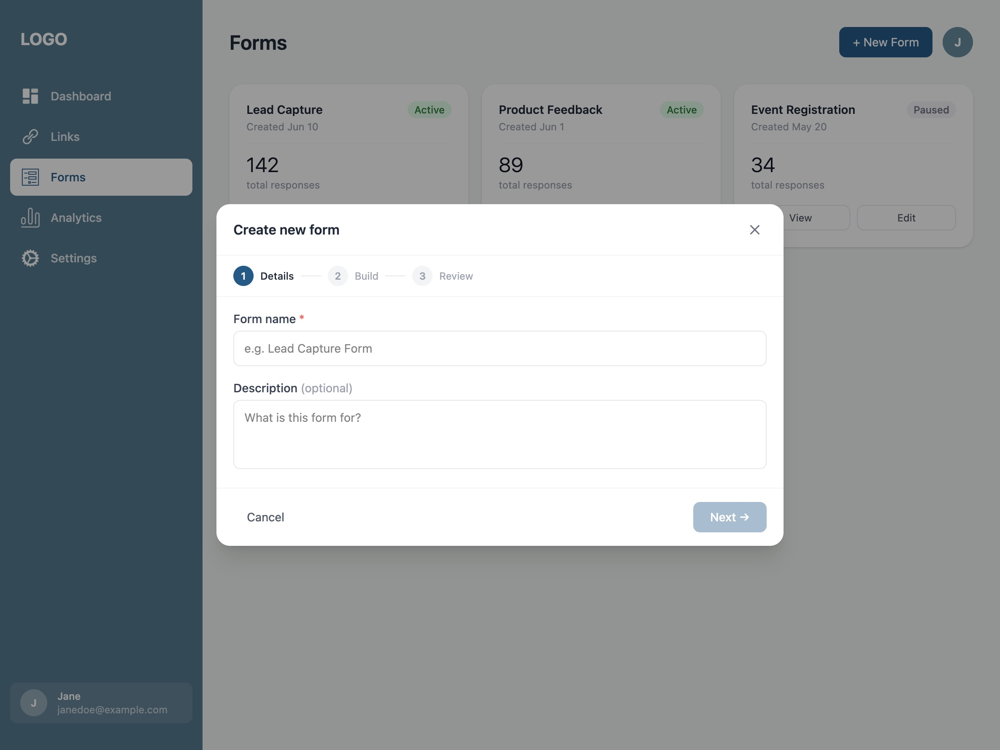
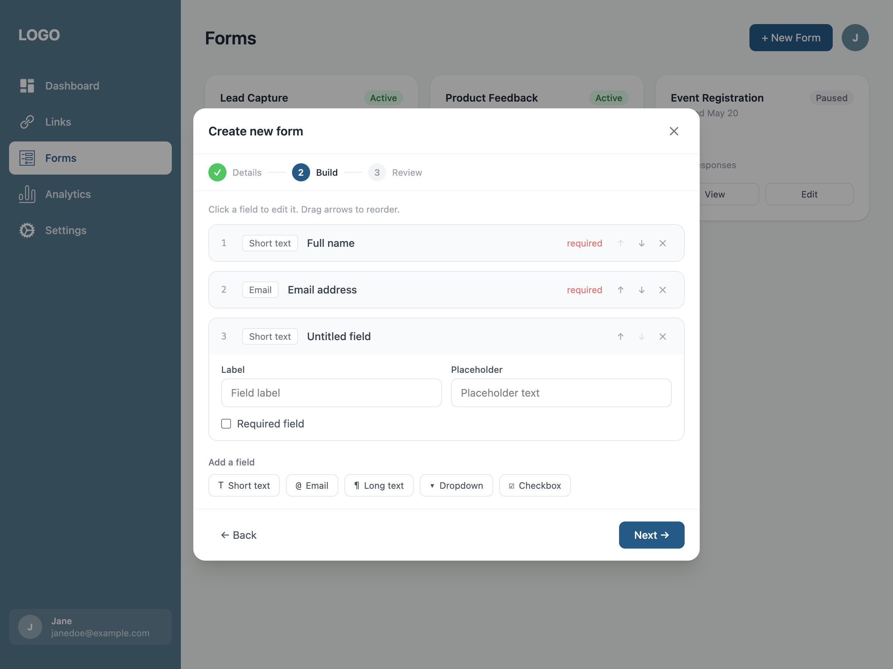
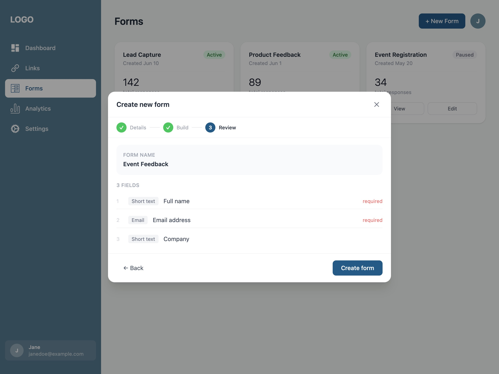
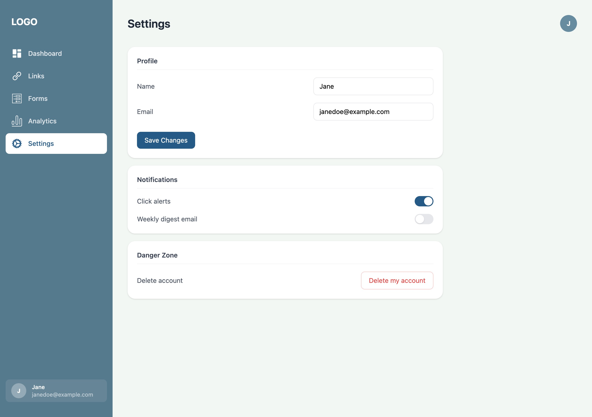

# URL Shortening & Tracking Platform

A demo SaaS platform for creating short links, building forms, and tracking engagement — all from a single dashboard.

This project was built to explore a full-featured product experience: authentication, a multi-page dashboard, a form builder, and analytics, all wrapped in a consistent design system.


## Features
- **Landing page** — public-facing marketing page introducing the platform
- **Authentication** — login flow to access the dashboard
- **Dashboard overview** — at-a-glance summary of account activity and key stats
- **Link shortening** — create, manage, and track shortened URLs
- **Form builder** — create custom forms with a multi-step wizard
- **Analytics** — visualize clicks, submissions, and engagement over time
- **Settings** — manage account and platform preferences

## Tech Stack
- **React** + **TypeScript**
- **TanStack Router** — file-based routing for the dashboard
- **Tailwind CSS** — styling with a consistent brand palette
- Fully responsive across mobile, tablet, and desktop breakpoints

## Screenshots












## Run Locally

Clone the project

```bash
  git clone https://github.com/nerbrain/urlShortener
```

Go to the project directory

```bash
  cd urlShortener
```

Install dependencies

```bash
  npm install
```

Start the development server

```bash
  npm run dev
```

## Linting & Formatting

This project uses [Biome](https://biomejs.dev/) for linting and formatting. The following scripts are available:


```bash
npm run lint
npm run format
npm run check
```

## Status
This is a portfolio project and is under active development.